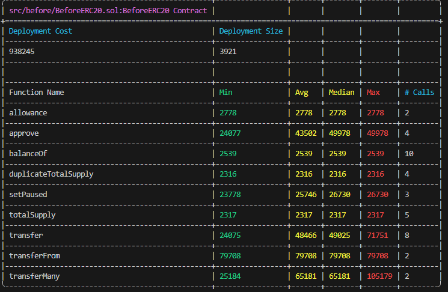
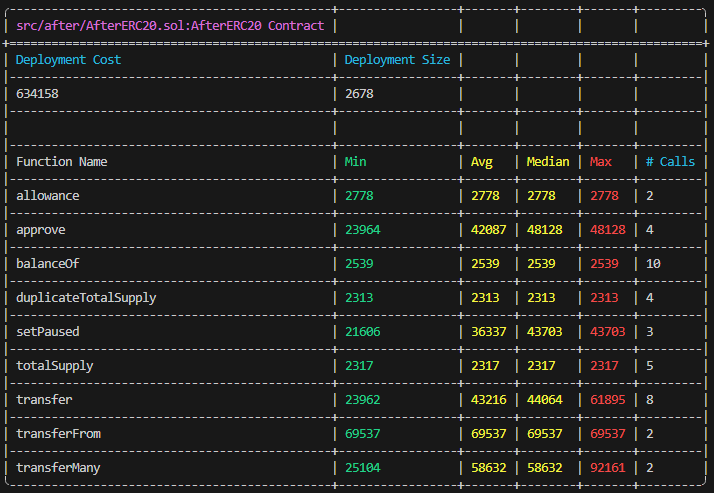
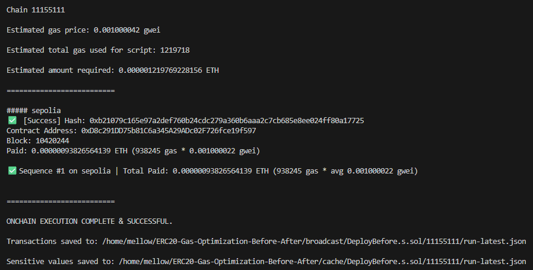
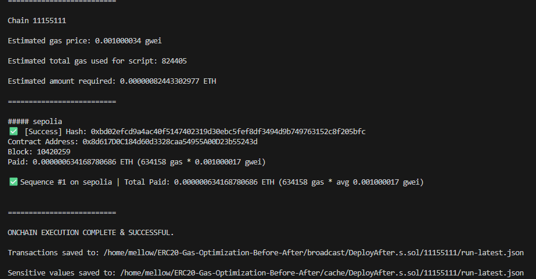

# ERC20-Gas-Optimization-Before-After

This repository demonstrates gas cost optimizations for a simple ERC20 token smart contract with a 5% transfer tax (burned). The "Before" version is inefficient, while the "After" version applies best practices to reduce gas usage by 20-50% without changing functionality. 

## Problem: Common Gas Inefficiencies in ERC20 Contracts
Many ERC20 tokens waste gas on deployment and transactions due to poor coding patterns. For example:
- Redundant state variables (e.g., duplicating `totalSupply` for no reason).
- Inefficient error handling with `require` and strings (expensive reverts).
- No `unchecked` math for safe operations.
- Unnecessary emits or local variable copies.

Here's a snippet from the "Before" version's `_transfer` function showing redundancies:

```solidity
function _transfer(address from, address to, uint256 amount) internal {
    require(from != address(0), "ERC20: transfer from the zero address"); // Inefficient: String revert costs more gas
    require(to != address(0), "ERC20: transfer to the zero address");
    require(amount > 0, "Transfer amount must be greater than zero");

    uint256 fromBalance = _balances[from]; // Redundant local copy – could cache but not optimized
    require(fromBalance >= amount, "ERC20: transfer amount exceeds balance");

    uint256 tax = (amount * 5) / 100; // No unchecked – unnecessary overflow check
    uint256 amountAfterTax = amount - tax;

    _balances[from] = fromBalance - amount; // Write without optimization
    _balances[to] += amountAfterTax;
    _totalSupply -= tax; // Burn tax
    duplicateTotalSupply = _totalSupply; // Redundant mirror variable – wastes storage

    emit Transfer(from, to, amountAfterTax);
    emit Transfer(from, address(0), tax); // Extra emit for burn – could combine
    emit Approval(from, to, amount); // Unnecessary duplicate Approval emit
}

## solution 
- function _transfer(address from, address to, uint256 amount) internal {
+ function _transfer(address from, address to, uint256 amount) internal override {
-    require(from != address(0), "ERC20: transfer from the zero address");
+    if (from == address(0)) revert TransferFromZeroAddress();
    // ... similar for other checks

-    uint256 tax = (amount * 5) / 100;
+    uint256 tax = (amount * TAX_PERCENTAGE) / 100; // Constant for tax

-    uint256 amountAfterTax = amount - tax;
+    unchecked { // Safe here – amount > tax
+        amountAfterTax = amount - tax;
+    }

-    emit Transfer(from, to, amountAfterTax);
-    emit Transfer(from, address(0), tax);
-    emit Approval(from, to, amount); // Removed unnecessary Approval
+    emit Transfer(from, to, amountAfterTax);
+    emit Transfer(from, address(0), tax); // Kept essential emits only
}
## Gas Results

Measured with:

```bash
forge test --gas-report
```

| Function | Before Gas | After Gas | Gas Saved | % Savings |
|----------|-----------:|----------:|----------:|----------:|
| Deploy | 938,245 | 634,158 | 304,087 | 32.41% |
| approve | 43,502 | 42,087 | 1,415 | 3.25% |
| transfer | 48,466 | 43,216 | 5,250 | 10.83% |
| transferFrom | 79,708 | 69,537 | 10,171 | 12.76% |
| transferMany | 65,181 | 58,632 | 6,549 | 10.05% |

### Gas Report Comparison

#### BeforeERC20 Gas Report


#### AfterERC20 Gas Report


### Key Takeaways

- Deployment cost reduced by **32.41%**
- `transferFrom` reduced by **12.76%**
- `transfer` reduced by **10.83%**
- `transferMany` reduced by **10.05%**
- Same functionality preserved across both contracts with **15 passing Foundry tests**

## Live Deployments on Sepolia

### BeforeERC20
- Contract Address: `0xD8c291DD75b81C6a345A29ADc02F726fce19f597`
- Transaction Hash: `0xb21079c165e97a2def760b24cdc279a360b6aaa2c7cb685e8ee024ff80a17725`
- Block: `10420244`
- Deployment Gas Used: `938245`

### AfterERC20
- Contract Address: `0x8d617D0C184d60d3328caa54955A00D23b55243d`
- Transaction Hash: `0xbd02efcd9a4ac40f5147402319d30ebc5fef8df3494d9b749763152c8f205bfc`
- Block: `10420259`
- Deployment Gas Used: `634158`

### Deployment Summary

The optimized ERC20 reduced deployment gas from **938245** to **634158**, saving **304087 gas** or **32.41%** while preserving the same functionality.

## Contract Verification

Both contracts are verified on Sepolia Etherscan.

### BeforeERC20
- Address: `0xD8c291DD75b81C6a345A29ADc02F726fce19f597`

### AfterERC20
- Address: `0x8d617D0C184d60d3328caa54955A00D23b55243d`

## Live Deployments on Sepolia

### BeforeERC20
- Contract Address: `0xD8c291DD75b81C6a345A29ADc02F726fce19f597`
- Transaction Hash: `0xb21079c165e97a2def760b24cdc279a360b6aaa2c7cb685e8ee024ff80a17725`
- Block: `10420244`
- Deployment Gas Used: `938245`

### AfterERC20
- Contract Address: `0x8d617D0C184d60d3328caa54955A00D23b55243d`
- Transaction Hash: `0xbd02efcd9a4ac40f5147402319d30ebc5fef8df3494d9b749763152c8f205bfc`
- Block: `10420259`
- Deployment Gas Used: `634158`

### Deployment Summary
The optimized ERC20 reduced deployment gas from **938245** to **634158**, saving **304087 gas** or **32.41%** while preserving the same functionality.


### Live Sepolia Deployments

#### BeforeERC20 Deployment


#### AfterERC20 Deployment



## Static Analysis

This project was analyzed with Slither to compare the unoptimized and optimized implementations.

### Commands used

```bash
slither src/before/BeforeERC20.sol
slither src/after/AfterERC20.sol
slither . --print human-summary